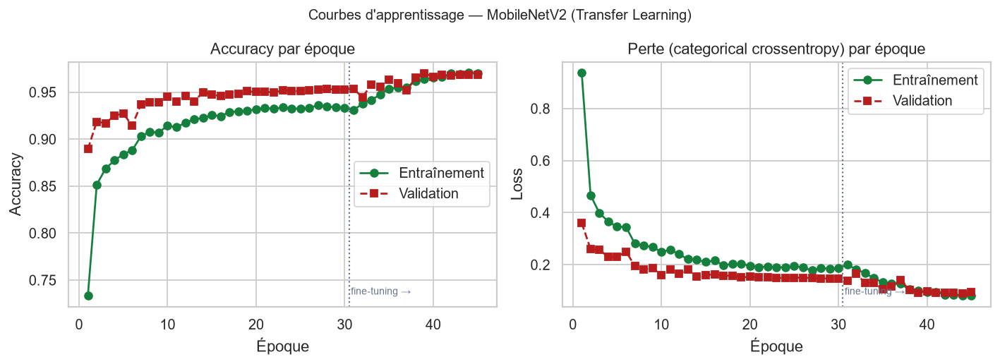
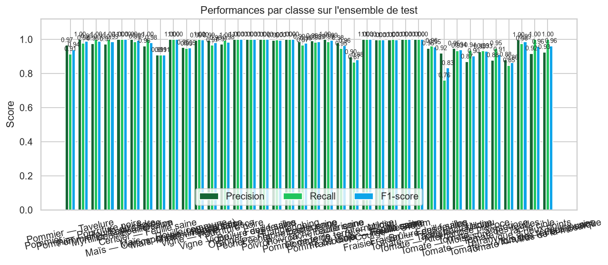
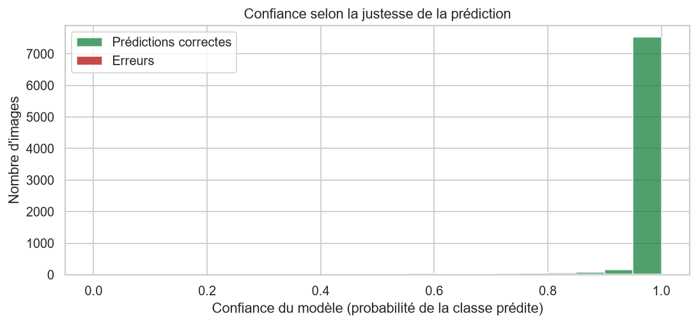

# Fiche expérimentale — Détection des maladies des feuilles (PlantVillage, 38 classes)

**Modèle** : MobileNetV2 + Transfer Learning  
**Expérience réalisée le** : 2026-11-17  
**Environnement** : Python 3.12.10, TensorFlow 2.21.0, CPU (sans GPU)  
**Fiche générée le** : 17/11/2026

## 1. Paramètres d'entraînement

| Paramètre | Valeur |
| --- | --- |
| Taille d'image | 224 × 224 × 3 |
| Batch size | 32 |
| Optimiseur | Adam |
| Perte | categorical_crossentropy |
| Époques phase 1 (effectuées / max) | 30 / 30 |
| Learning rate phase 1 | 0.001 |
| Époques phase 2 (fine-tuning) | 15 |
| Learning rate phase 2 | 1e-05 |
| Couches examinées en fin de base | 30 |
| Couches dégelées (drapeau trainable) | 19 |
| Couches réellement réentraînées (porteuses de poids) | 10 |
| BatchNormalization maintenues gelées | 52 / 52 |
| Graine aléatoire | 42 |
| Early Stopping | patience 5 sur val_loss |
| Model Checkpoint | meilleur val_accuracy (best_model.keras) |
| Paramètres totaux | 2 426 854 |
| Paramètres entraînables (phase 1) | 168 870 |

Data Augmentation : rotation ±5 %, zoom ±10 %, retournement horizontal, luminosité ±15 %, translation ±5 %.

## 2. Effectifs par classe

| Classe | Dataset brut | Entraînement | Validation | Test |
| --- | --- | --- | --- | --- |
| Apple — Apple scab (Apple___Apple_scab) | 630 | 442 | 94 | 94 |
| Apple — Black rot (Apple___Black_rot) | 621 | 435 | 93 | 93 |
| Apple — Cedar apple rust (Apple___Cedar_apple_rust) | 275 | 193 | 41 | 41 |
| Apple — healthy (Apple___healthy) | 1645 | 1151 | 247 | 247 |
| Blueberry — healthy (Blueberry___healthy) | 1502 | 1052 | 225 | 225 |
| Cherry (including sour) — Powdery mildew (Cherry_(including_sour)___Powdery_mildew) | 1052 | 736 | 158 | 158 |
| Cherry (including sour) — healthy (Cherry_(including_sour)___healthy) | 854 | 598 | 128 | 128 |
| Corn (maize) — Cercospora leaf spot Gray leaf spot (Corn_(maize)___Cercospora_leaf_spot Gray_leaf_spot) | 513 | 359 | 77 | 77 |
| Corn (maize) — Common rust (Corn_(maize)___Common_rust_) | 1192 | 834 | 179 | 179 |
| Corn (maize) — Northern Leaf Blight (Corn_(maize)___Northern_Leaf_Blight) | 985 | 689 | 148 | 148 |
| Corn (maize) — healthy (Corn_(maize)___healthy) | 1162 | 814 | 174 | 174 |
| Grape — Black rot (Grape___Black_rot) | 1180 | 826 | 177 | 177 |
| Grape — Esca (Black Measles) (Grape___Esca_(Black_Measles)) | 1383 | 969 | 207 | 207 |
| Grape — Leaf blight (Isariopsis Leaf Spot) (Grape___Leaf_blight_(Isariopsis_Leaf_Spot)) | 1076 | 754 | 161 | 161 |
| Grape — healthy (Grape___healthy) | 423 | 297 | 63 | 63 |
| Orange — Haunglongbing (Citrus greening) (Orange___Haunglongbing_(Citrus_greening)) | 5507 | 3855 | 826 | 826 |
| Peach — Bacterial spot (Peach___Bacterial_spot) | 2297 | 1607 | 345 | 345 |
| Peach — healthy (Peach___healthy) | 360 | 252 | 54 | 54 |
| Pepper, bell — Bacterial spot (Pepper,_bell___Bacterial_spot) | 997 | 697 | 150 | 150 |
| Pepper, bell — healthy (Pepper,_bell___healthy) | 1478 | 1034 | 222 | 222 |
| Potato — Early blight (Potato___Early_blight) | 1000 | 700 | 150 | 150 |
| Potato — Late blight (Potato___Late_blight) | 1000 | 700 | 150 | 150 |
| Potato — healthy (Potato___healthy) | 152 | 92 | 30 | 30 |
| Raspberry — healthy (Raspberry___healthy) | 371 | 259 | 56 | 56 |
| Soybean — healthy (Soybean___healthy) | 5090 | 3562 | 764 | 764 |
| Squash — Powdery mildew (Squash___Powdery_mildew) | 1835 | 1285 | 275 | 275 |
| Strawberry — Leaf scorch (Strawberry___Leaf_scorch) | 1109 | 777 | 166 | 166 |
| Strawberry — healthy (Strawberry___healthy) | 456 | 320 | 68 | 68 |
| Tomato — Bacterial spot (Tomato___Bacterial_spot) | 2127 | 1489 | 319 | 319 |
| Alternariose précoce (Tomato___Early_blight) | 1000 | 700 | 150 | 150 |
| Mildiou (Tomato___Late_blight) | 1909 | 1337 | 286 | 286 |
| Moisissure des feuilles (Tomato___Leaf_Mold) | 952 | 666 | 143 | 143 |
| Tomato — Septoria leaf spot (Tomato___Septoria_leaf_spot) | 1771 | 1239 | 266 | 266 |
| Tomato — Spider mites Two-spotted spider mite (Tomato___Spider_mites Two-spotted_spider_mite) | 1676 | 1174 | 251 | 251 |
| Tomato — Target Spot (Tomato___Target_Spot) | 1404 | 982 | 211 | 211 |
| Tomato — Tomato Yellow Leaf Curl Virus (Tomato___Tomato_Yellow_Leaf_Curl_Virus) | 5357 | 3749 | 804 | 804 |
| Tomato — Tomato mosaic virus (Tomato___Tomato_mosaic_virus) | 373 | 261 | 56 | 56 |
| Feuille saine (Tomato___healthy) | 1591 | 1113 | 239 | 239 |
| **Total** | **54305** | **37999** | **8153** | **8153** |

Découpage stratifié, graine 42, 21 groupes de doublons exacts (MD5 global) regroupés, 0 conflit(s) d'annotation, 196 groupes de quasi-doublons signalés, 0 image(s) illisible(s).

## 3. Courbes d'apprentissage

Meilleure accuracy de validation : **97,02 %** (époque 39, sur 45 époques).

| Phase | Époques | Meilleure val_accuracy | Durée |
| --- | --- | --- | --- |
| Phase 1 — base gelée | 30 | 95,31 % | 474.77 min |
| Phase 2 — fine-tuning | 15 | 97,02 % | 257.6 min |

## 4. Métriques sur l'ensemble de test

| Métrique | Valeur |
| --- | --- |
| Accuracy | **97,31 %** |
| Precision (macro) | 96,72 % |
| Recall (macro) | 96,68 % |
| F1-score (macro) | **96,65 %** |
| F1-score (pondéré) | 97,30 % |
| Images de test | 8153 |
| Images mal classées | 219 (2,69 %) |

## 5. Matrice de confusion

| Réel \ Prédit | Apple — Apple scab | Apple — Black rot | Apple — Cedar apple rust | Apple — healthy | Blueberry — healthy | Cherry (including sour) — Powdery mildew | Cherry (including sour) — healthy | Corn (maize) — Cercospora leaf spot Gray leaf spot | Corn (maize) — Common rust | Corn (maize) — Northern Leaf Blight | Corn (maize) — healthy | Grape — Black rot | Grape — Esca (Black Measles) | Grape — Leaf blight (Isariopsis Leaf Spot) | Grape — healthy | Orange — Haunglongbing (Citrus greening) | Peach — Bacterial spot | Peach — healthy | Pepper, bell — Bacterial spot | Pepper, bell — healthy | Potato — Early blight | Potato — Late blight | Potato — healthy | Raspberry — healthy | Soybean — healthy | Squash — Powdery mildew | Strawberry — Leaf scorch | Strawberry — healthy | Tomato — Bacterial spot | Alternariose précoce | Mildiou | Moisissure des feuilles | Tomato — Septoria leaf spot | Tomato — Spider mites Two-spotted spider mite | Tomato — Target Spot | Tomato — Tomato Yellow Leaf Curl Virus | Tomato — Tomato mosaic virus | Feuille saine |
| --- | --- | --- | --- | --- | --- | --- | --- | --- | --- | --- | --- | --- | --- | --- | --- | --- | --- | --- | --- | --- | --- | --- | --- | --- | --- | --- | --- | --- | --- | --- | --- | --- | --- | --- | --- | --- | --- | --- |
| Apple — Apple scab | 86 | 0 | 1 | 5 | 0 | 0 | 0 | 0 | 0 | 0 | 0 | 0 | 0 | 0 | 0 | 0 | 1 | 0 | 0 | 0 | 0 | 0 | 0 | 0 | 0 | 1 | 0 | 0 | 0 | 0 | 0 | 0 | 0 | 0 | 0 | 0 | 0 | 0 |
| Apple — Black rot | 0 | 91 | 0 | 1 | 0 | 0 | 0 | 0 | 0 | 0 | 0 | 0 | 0 | 0 | 0 | 0 | 0 | 0 | 1 | 0 | 0 | 0 | 0 | 0 | 0 | 0 | 0 | 0 | 0 | 0 | 0 | 0 | 0 | 0 | 0 | 0 | 0 | 0 |
| Apple — Cedar apple rust | 0 | 0 | 41 | 0 | 0 | 0 | 0 | 0 | 0 | 0 | 0 | 0 | 0 | 0 | 0 | 0 | 0 | 0 | 0 | 0 | 0 | 0 | 0 | 0 | 0 | 0 | 0 | 0 | 0 | 0 | 0 | 0 | 0 | 0 | 0 | 0 | 0 | 0 |
| Apple — healthy | 0 | 0 | 0 | 247 | 0 | 0 | 0 | 0 | 0 | 0 | 0 | 0 | 0 | 0 | 0 | 0 | 0 | 0 | 0 | 0 | 0 | 0 | 0 | 0 | 0 | 0 | 0 | 0 | 0 | 0 | 0 | 0 | 0 | 0 | 0 | 0 | 0 | 0 |
| Blueberry — healthy | 0 | 0 | 0 | 0 | 225 | 0 | 0 | 0 | 0 | 0 | 0 | 0 | 0 | 0 | 0 | 0 | 0 | 0 | 0 | 0 | 0 | 0 | 0 | 0 | 0 | 0 | 0 | 0 | 0 | 0 | 0 | 0 | 0 | 0 | 0 | 0 | 0 | 0 |
| Cherry (including sour) — Powdery mildew | 1 | 0 | 0 | 0 | 0 | 156 | 0 | 0 | 0 | 0 | 0 | 0 | 0 | 0 | 0 | 0 | 0 | 0 | 0 | 0 | 0 | 0 | 0 | 0 | 0 | 0 | 0 | 0 | 0 | 0 | 0 | 0 | 0 | 0 | 0 | 0 | 0 | 1 |
| Cherry (including sour) — healthy | 0 | 0 | 0 | 0 | 0 | 0 | 128 | 0 | 0 | 0 | 0 | 0 | 0 | 0 | 0 | 0 | 0 | 0 | 0 | 0 | 0 | 0 | 0 | 0 | 0 | 0 | 0 | 0 | 0 | 0 | 0 | 0 | 0 | 0 | 0 | 0 | 0 | 0 |
| Corn (maize) — Cercospora leaf spot Gray leaf spot | 0 | 0 | 0 | 0 | 0 | 0 | 0 | 70 | 0 | 7 | 0 | 0 | 0 | 0 | 0 | 0 | 0 | 0 | 0 | 0 | 0 | 0 | 0 | 0 | 0 | 0 | 0 | 0 | 0 | 0 | 0 | 0 | 0 | 0 | 0 | 0 | 0 | 0 |
| Corn (maize) — Common rust | 0 | 0 | 0 | 0 | 0 | 0 | 0 | 0 | 179 | 0 | 0 | 0 | 0 | 0 | 0 | 0 | 0 | 0 | 0 | 0 | 0 | 0 | 0 | 0 | 0 | 0 | 0 | 0 | 0 | 0 | 0 | 0 | 0 | 0 | 0 | 0 | 0 | 0 |
| Corn (maize) — Northern Leaf Blight | 0 | 0 | 0 | 0 | 0 | 0 | 0 | 7 | 0 | 140 | 1 | 0 | 0 | 0 | 0 | 0 | 0 | 0 | 0 | 0 | 0 | 0 | 0 | 0 | 0 | 0 | 0 | 0 | 0 | 0 | 0 | 0 | 0 | 0 | 0 | 0 | 0 | 0 |
| Corn (maize) — healthy | 0 | 0 | 0 | 0 | 0 | 0 | 0 | 0 | 0 | 0 | 174 | 0 | 0 | 0 | 0 | 0 | 0 | 0 | 0 | 0 | 0 | 0 | 0 | 0 | 0 | 0 | 0 | 0 | 0 | 0 | 0 | 0 | 0 | 0 | 0 | 0 | 0 | 0 |
| Grape — Black rot | 0 | 0 | 0 | 0 | 0 | 0 | 0 | 0 | 0 | 0 | 0 | 171 | 6 | 0 | 0 | 0 | 0 | 0 | 0 | 0 | 0 | 0 | 0 | 0 | 0 | 0 | 0 | 0 | 0 | 0 | 0 | 0 | 0 | 0 | 0 | 0 | 0 | 0 |
| Grape — Esca (Black Measles) | 0 | 0 | 0 | 0 | 0 | 0 | 0 | 0 | 0 | 0 | 0 | 1 | 206 | 0 | 0 | 0 | 0 | 0 | 0 | 0 | 0 | 0 | 0 | 0 | 0 | 0 | 0 | 0 | 0 | 0 | 0 | 0 | 0 | 0 | 0 | 0 | 0 | 0 |
| Grape — Leaf blight (Isariopsis Leaf Spot) | 0 | 0 | 0 | 0 | 0 | 0 | 0 | 0 | 0 | 0 | 0 | 0 | 0 | 161 | 0 | 0 | 0 | 0 | 0 | 0 | 0 | 0 | 0 | 0 | 0 | 0 | 0 | 0 | 0 | 0 | 0 | 0 | 0 | 0 | 0 | 0 | 0 | 0 |
| Grape — healthy | 0 | 0 | 0 | 0 | 0 | 0 | 0 | 0 | 0 | 0 | 0 | 0 | 0 | 0 | 63 | 0 | 0 | 0 | 0 | 0 | 0 | 0 | 0 | 0 | 0 | 0 | 0 | 0 | 0 | 0 | 0 | 0 | 0 | 0 | 0 | 0 | 0 | 0 |
| Orange — Haunglongbing (Citrus greening) | 0 | 0 | 0 | 0 | 0 | 0 | 0 | 0 | 0 | 0 | 0 | 0 | 0 | 0 | 0 | 826 | 0 | 0 | 0 | 0 | 0 | 0 | 0 | 0 | 0 | 0 | 0 | 0 | 0 | 0 | 0 | 0 | 0 | 0 | 0 | 0 | 0 | 0 |
| Peach — Bacterial spot | 0 | 0 | 0 | 0 | 0 | 0 | 0 | 0 | 0 | 0 | 0 | 0 | 0 | 0 | 0 | 0 | 344 | 0 | 0 | 0 | 0 | 0 | 0 | 0 | 0 | 0 | 0 | 0 | 0 | 0 | 0 | 0 | 1 | 0 | 0 | 0 | 0 | 0 |
| Peach — healthy | 0 | 0 | 0 | 0 | 0 | 0 | 0 | 0 | 0 | 0 | 0 | 0 | 0 | 0 | 0 | 0 | 0 | 54 | 0 | 0 | 0 | 0 | 0 | 0 | 0 | 0 | 0 | 0 | 0 | 0 | 0 | 0 | 0 | 0 | 0 | 0 | 0 | 0 |
| Pepper, bell — Bacterial spot | 1 | 0 | 0 | 0 | 0 | 0 | 0 | 0 | 0 | 0 | 0 | 0 | 0 | 0 | 0 | 1 | 0 | 0 | 145 | 2 | 0 | 0 | 0 | 0 | 0 | 0 | 0 | 0 | 0 | 0 | 0 | 0 | 0 | 1 | 0 | 0 | 0 | 0 |
| Pepper, bell — healthy | 0 | 0 | 0 | 0 | 0 | 0 | 2 | 0 | 0 | 0 | 0 | 0 | 0 | 0 | 0 | 0 | 1 | 0 | 0 | 218 | 0 | 0 | 0 | 0 | 1 | 0 | 0 | 0 | 0 | 0 | 0 | 0 | 0 | 0 | 0 | 0 | 0 | 0 |
| Potato — Early blight | 0 | 0 | 0 | 0 | 0 | 0 | 0 | 0 | 0 | 0 | 0 | 0 | 0 | 0 | 0 | 0 | 0 | 0 | 0 | 0 | 148 | 1 | 0 | 0 | 0 | 0 | 0 | 0 | 0 | 0 | 0 | 0 | 1 | 0 | 0 | 0 | 0 | 0 |
| Potato — Late blight | 0 | 0 | 0 | 0 | 0 | 0 | 0 | 0 | 0 | 0 | 0 | 0 | 0 | 0 | 0 | 0 | 0 | 0 | 0 | 0 | 0 | 142 | 3 | 0 | 0 | 0 | 0 | 0 | 0 | 0 | 4 | 0 | 0 | 1 | 0 | 0 | 0 | 0 |
| Potato — healthy | 0 | 0 | 0 | 0 | 0 | 0 | 1 | 0 | 0 | 0 | 0 | 0 | 0 | 0 | 0 | 0 | 0 | 0 | 0 | 0 | 0 | 1 | 26 | 0 | 2 | 0 | 0 | 0 | 0 | 0 | 0 | 0 | 0 | 0 | 0 | 0 | 0 | 0 |
| Raspberry — healthy | 0 | 0 | 0 | 0 | 0 | 0 | 0 | 0 | 0 | 0 | 0 | 0 | 0 | 0 | 0 | 0 | 0 | 0 | 0 | 0 | 0 | 0 | 0 | 56 | 0 | 0 | 0 | 0 | 0 | 0 | 0 | 0 | 0 | 0 | 0 | 0 | 0 | 0 |
| Soybean — healthy | 0 | 0 | 0 | 1 | 0 | 0 | 2 | 0 | 0 | 0 | 0 | 0 | 0 | 0 | 0 | 0 | 0 | 0 | 0 | 0 | 0 | 0 | 0 | 0 | 761 | 0 | 0 | 0 | 0 | 0 | 0 | 0 | 0 | 0 | 0 | 0 | 0 | 0 |
| Squash — Powdery mildew | 0 | 0 | 0 | 0 | 0 | 0 | 0 | 0 | 0 | 0 | 0 | 0 | 0 | 0 | 0 | 0 | 0 | 0 | 0 | 0 | 0 | 0 | 0 | 0 | 0 | 275 | 0 | 0 | 0 | 0 | 0 | 0 | 0 | 0 | 0 | 0 | 0 | 0 |
| Strawberry — Leaf scorch | 0 | 0 | 0 | 0 | 0 | 0 | 0 | 0 | 0 | 0 | 0 | 0 | 0 | 0 | 0 | 0 | 0 | 0 | 0 | 0 | 0 | 0 | 0 | 0 | 0 | 0 | 166 | 0 | 0 | 0 | 0 | 0 | 0 | 0 | 0 | 0 | 0 | 0 |
| Strawberry — healthy | 0 | 0 | 0 | 0 | 0 | 0 | 0 | 0 | 0 | 0 | 0 | 0 | 0 | 0 | 0 | 0 | 0 | 0 | 0 | 0 | 0 | 0 | 0 | 0 | 0 | 0 | 0 | 68 | 0 | 0 | 0 | 0 | 0 | 0 | 0 | 0 | 0 | 0 |
| Tomato — Bacterial spot | 0 | 0 | 0 | 0 | 0 | 0 | 0 | 0 | 0 | 0 | 0 | 0 | 0 | 0 | 0 | 0 | 0 | 0 | 0 | 0 | 0 | 0 | 0 | 0 | 0 | 0 | 0 | 0 | 307 | 1 | 1 | 2 | 4 | 1 | 2 | 1 | 0 | 0 |
| Alternariose précoce | 0 | 0 | 0 | 0 | 0 | 0 | 0 | 0 | 0 | 0 | 0 | 0 | 0 | 0 | 0 | 0 | 0 | 0 | 1 | 0 | 0 | 1 | 0 | 0 | 0 | 0 | 0 | 0 | 3 | 114 | 9 | 4 | 8 | 2 | 7 | 1 | 0 | 0 |
| Mildiou | 1 | 0 | 0 | 0 | 0 | 0 | 0 | 0 | 0 | 0 | 0 | 0 | 0 | 0 | 0 | 0 | 0 | 0 | 0 | 0 | 0 | 0 | 0 | 0 | 0 | 0 | 0 | 0 | 0 | 5 | 267 | 4 | 2 | 2 | 5 | 0 | 0 | 0 |
| Moisissure des feuilles | 0 | 0 | 0 | 0 | 0 | 0 | 0 | 0 | 0 | 0 | 0 | 0 | 0 | 0 | 0 | 0 | 0 | 0 | 0 | 0 | 0 | 0 | 0 | 0 | 0 | 0 | 0 | 0 | 0 | 0 | 1 | 134 | 1 | 5 | 2 | 0 | 0 | 0 |
| Tomato — Septoria leaf spot | 0 | 0 | 0 | 0 | 0 | 0 | 0 | 0 | 0 | 0 | 0 | 0 | 0 | 0 | 0 | 0 | 0 | 0 | 0 | 0 | 0 | 0 | 0 | 0 | 0 | 0 | 0 | 0 | 4 | 1 | 0 | 6 | 248 | 2 | 4 | 0 | 0 | 1 |
| Tomato — Spider mites Two-spotted spider mite | 0 | 0 | 0 | 0 | 0 | 0 | 0 | 0 | 0 | 0 | 0 | 0 | 0 | 0 | 0 | 0 | 0 | 0 | 0 | 0 | 0 | 0 | 0 | 0 | 0 | 0 | 0 | 0 | 0 | 1 | 0 | 1 | 0 | 238 | 4 | 0 | 1 | 6 |
| Tomato — Target Spot | 0 | 0 | 0 | 0 | 0 | 0 | 0 | 0 | 0 | 0 | 0 | 0 | 0 | 0 | 0 | 0 | 0 | 0 | 0 | 0 | 0 | 0 | 0 | 0 | 0 | 0 | 0 | 0 | 3 | 2 | 0 | 1 | 1 | 14 | 179 | 0 | 0 | 11 |
| Tomato — Tomato Yellow Leaf Curl Virus | 0 | 0 | 0 | 0 | 0 | 0 | 0 | 0 | 0 | 0 | 0 | 0 | 0 | 0 | 0 | 0 | 0 | 0 | 0 | 0 | 0 | 0 | 0 | 0 | 0 | 0 | 0 | 0 | 7 | 0 | 0 | 2 | 1 | 5 | 0 | 785 | 4 | 0 |
| Tomato — Tomato mosaic virus | 0 | 0 | 0 | 0 | 0 | 0 | 0 | 0 | 0 | 0 | 0 | 0 | 0 | 0 | 0 | 0 | 0 | 0 | 0 | 0 | 0 | 0 | 0 | 0 | 0 | 0 | 0 | 0 | 0 | 0 | 0 | 0 | 0 | 0 | 0 | 0 | 56 | 0 |
| Feuille saine | 0 | 0 | 0 | 0 | 0 | 0 | 0 | 0 | 0 | 0 | 0 | 0 | 0 | 0 | 0 | 0 | 0 | 0 | 0 | 0 | 0 | 0 | 0 | 0 | 0 | 0 | 0 | 0 | 0 | 0 | 0 | 0 | 0 | 0 | 0 | 0 | 0 | 239 |

## 6. Résultats par classe

| Classe | Precision | Recall | F1-score | Support | Bien classées | Confiance moyenne |
| --- | --- | --- | --- | --- | --- | --- |
| Apple — Apple scab | 96,63 % | 91,49 % | 93,99 % | 94 | 86 | 97,17 % |
| Apple — Black rot | 100,00 % | 97,85 % | 98,91 % | 93 | 91 | 99,70 % |
| Apple — Cedar apple rust | 97,62 % | 100,00 % | 98,80 % | 41 | 41 | 99,98 % |
| Apple — healthy | 97,24 % | 100,00 % | 98,60 % | 247 | 247 | 99,80 % |
| Blueberry — healthy | 100,00 % | 100,00 % | 100,00 % | 225 | 225 | 99,37 % |
| Cherry (including sour) — Powdery mildew | 100,00 % | 98,73 % | 99,36 % | 158 | 156 | 99,59 % |
| Cherry (including sour) — healthy | 96,24 % | 100,00 % | 98,08 % | 128 | 128 | 100,00 % |
| Corn (maize) — Cercospora leaf spot Gray leaf spot | 90,91 % | 90,91 % | 90,91 % | 77 | 70 | 91,55 % |
| Corn (maize) — Common rust | 100,00 % | 100,00 % | 100,00 % | 179 | 179 | 100,00 % |
| Corn (maize) — Northern Leaf Blight | 95,24 % | 94,59 % | 94,92 % | 148 | 140 | 93,10 % |
| Corn (maize) — healthy | 99,43 % | 100,00 % | 99,71 % | 174 | 174 | 100,00 % |
| Grape — Black rot | 99,42 % | 96,61 % | 97,99 % | 177 | 171 | 97,04 % |
| Grape — Esca (Black Measles) | 97,17 % | 99,52 % | 98,33 % | 207 | 206 | 98,64 % |
| Grape — Leaf blight (Isariopsis Leaf Spot) | 100,00 % | 100,00 % | 100,00 % | 161 | 161 | 99,98 % |
| Grape — healthy | 100,00 % | 100,00 % | 100,00 % | 63 | 63 | 99,90 % |
| Orange — Haunglongbing (Citrus greening) | 99,88 % | 100,00 % | 99,94 % | 826 | 826 | 99,93 % |
| Peach — Bacterial spot | 99,42 % | 99,71 % | 99,57 % | 345 | 344 | 99,32 % |
| Peach — healthy | 100,00 % | 100,00 % | 100,00 % | 54 | 54 | 99,44 % |
| Pepper, bell — Bacterial spot | 98,64 % | 96,67 % | 97,64 % | 150 | 145 | 96,73 % |
| Pepper, bell — healthy | 99,09 % | 98,20 % | 98,64 % | 222 | 218 | 99,07 % |
| Potato — Early blight | 100,00 % | 98,67 % | 99,33 % | 150 | 148 | 99,40 % |
| Potato — Late blight | 97,93 % | 94,67 % | 96,27 % | 150 | 142 | 96,05 % |
| Potato — healthy | 89,66 % | 86,67 % | 88,14 % | 30 | 26 | 94,85 % |
| Raspberry — healthy | 100,00 % | 100,00 % | 100,00 % | 56 | 56 | 99,91 % |
| Soybean — healthy | 99,61 % | 99,61 % | 99,61 % | 764 | 761 | 99,31 % |
| Squash — Powdery mildew | 99,64 % | 100,00 % | 99,82 % | 275 | 275 | 99,95 % |
| Strawberry — Leaf scorch | 100,00 % | 100,00 % | 100,00 % | 166 | 166 | 99,74 % |
| Strawberry — healthy | 100,00 % | 100,00 % | 100,00 % | 68 | 68 | 99,79 % |
| Tomato — Bacterial spot | 94,75 % | 96,24 % | 95,49 % | 319 | 307 | 96,04 % |
| Alternariose précoce | 91,94 % | 76,00 % | 83,21 % | 150 | 114 | 82,23 % |
| Mildiou | 94,68 % | 93,36 % | 94,01 % | 286 | 267 | 92,96 % |
| Moisissure des feuilles | 87,01 % | 93,71 % | 90,24 % | 143 | 134 | 96,35 % |
| Tomato — Septoria leaf spot | 92,88 % | 93,23 % | 93,06 % | 266 | 248 | 90,13 % |
| Tomato — Spider mites Two-spotted spider mite | 87,82 % | 94,82 % | 91,19 % | 251 | 238 | 93,41 % |
| Tomato — Target Spot | 88,18 % | 84,83 % | 86,47 % | 211 | 179 | 85,78 % |
| Tomato — Tomato Yellow Leaf Curl Virus | 99,75 % | 97,64 % | 98,68 % | 804 | 785 | 98,34 % |
| Tomato — Tomato mosaic virus | 91,80 % | 100,00 % | 95,73 % | 56 | 56 | 98,96 % |
| Feuille saine | 92,64 % | 100,00 % | 96,18 % | 239 | 239 | 99,22 % |

## 7. Confiance et analyse des erreurs

| Indicateur | Valeur |
| --- | --- |
| Confiance moyenne (prédictions correctes) | 98,14 % |
| Confiance moyenne (erreurs) | 72,34 % |
| Confiance médiane | 100,00 % |
| Erreurs | 219 / 8153 (2,69 %) |

| Confusion observée | Nombre de cas |
| --- | --- |
| Tomato — Target Spot → Tomato — Spider mites Two-spotted spider mite | 14 |
| Tomato — Target Spot → Feuille saine | 11 |
| Alternariose précoce → Mildiou | 9 |
| Alternariose précoce → Tomato — Septoria leaf spot | 8 |
| Tomato — Tomato Yellow Leaf Curl Virus → Tomato — Bacterial spot | 7 |

## 8. Observations et difficultés rencontrées

- **Convergence rapide de la phase 1** : dès la première époque, la validation atteint 88,94 %, ce qui confirme la qualité des caractéristiques ImageNet.
- **Le fine-tuning apporte un gain réel de +1,70 point de validation** ; son learning rate très faible (1e-5) est indispensable pour ne pas détruire les poids pré-entraînés.
- **Les classes rares restent fragiles** : « Alternariose précoce » obtient le F1-score le plus bas (83,21 %), alors que 15 classes dépassent 99 %.
- **Le déséquilibre pèse sur les moyennes** : l'écart entre F1 pondéré et F1 macro est de 0,65 point, trace du traitement inégal des classes rares.
- **Le modèle est sur-confiant** : la confiance médiane atteint 99,999 % ; cette quasi-certitude justifie l'affichage des probabilités plutôt qu'une classe unique.
- **Budget d'entraînement lourd** : 45 époques au total sur 4 threads CPU (≈ 732 minutes).
- **Dataset de laboratoire** : les images ont un fond uniforme ; les performances mesurées ne préjugent pas du comportement sur des photos de terrain.
- **Doublons** : 21 groupes d'images identiques ont été détectés (empreinte MD5 calculée sur l'ensemble du dataset, toutes classes confondues) et regroupés pour éviter toute fuite ; 0 conflit(s) d'annotation et 196 groupes de quasi-doublons (empreinte perceptuelle) sont signalés pour inspection.

## 9. Conclusion de l'expérience

Le modèle MobileNetV2 adapté par Transfer Learning atteint **97,31 % d'accuracy** et un **F1-score macro de 96,65 %** sur 8153 images de test indépendantes, avec un temps d'inférence d'environ 110 ms par image sur CPU. Ces résultats confirment la faisabilité d'un outil local d'aide à la reconnaissance visuelle, dans les limites du périmètre étudié.

## 10. Fichiers de référence

| Ressource | Fichier |
| --- | --- |
| Configuration complète | `models/training_config.json` |
| Historique des époques | `results/metrics/training_history.json` |
| Rapport de classification | `results/metrics/classification_report.txt` |
| Métriques détaillées | `results/metrics.json` |
| Prédictions du test | `results/predictions/predictions_test.csv` |
| Erreurs détaillées | `results/predictions/erreurs.csv` |
